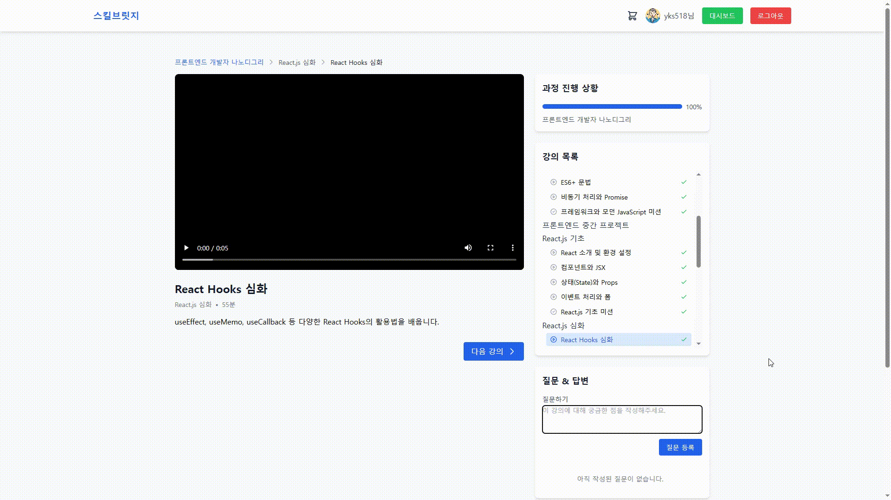
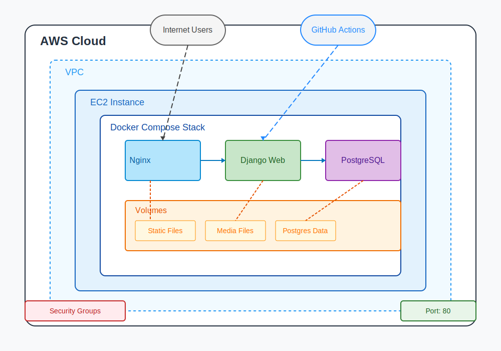
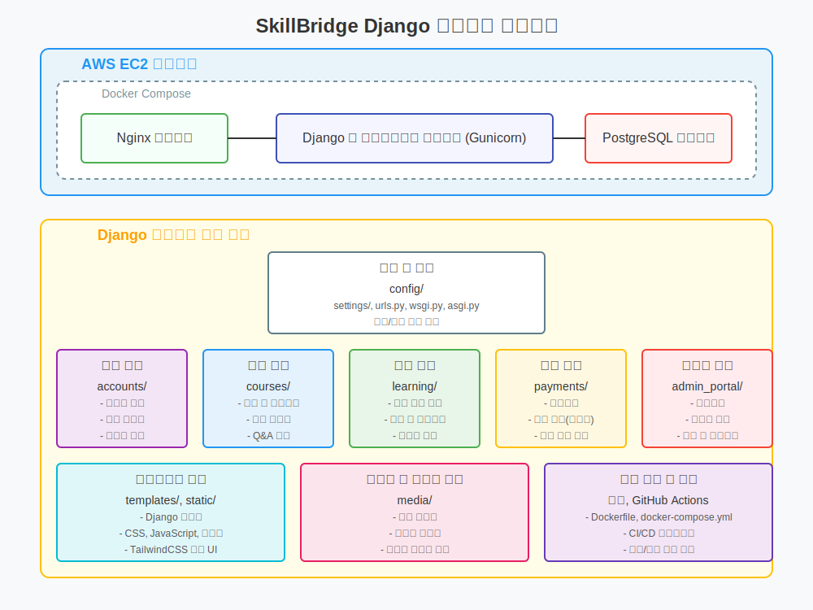

# 스킬브릿지 (SkillBridge)

## 📚 프로젝트 소개

스킬브릿지는 온라인 학습 플랫폼으로, 다양한 기술 분야의 강의를 제공하고 사용자들이 효과적으로 학습할 수 있는 환경을 제공합니다. 실무 중심의 미션, 프로젝트 기반 학습, 그리고 수료증 발급 시스템을 통해 사용자들이 체계적으로 기술을 습득할 수 있도록 설계되었습니다.

### 핵심 기능

- 😀 개인화된 사용자 경험 및 학습 관리
- 📝 체계적인 과정 관리 및 진행 상황 추적
- 🎓 미션, 프로젝트 기반의 실무 중심 학습
- 🏆 과정 완료 후 수료증 발급
- 💳 간편한 과정 결제 시스템
- 👨‍🏫 강사-학생 간 Q&A 소통 기능
- 👨‍💼 관리자를 위한 통합 플랫폼 관리 도구

---

## 💻 기술 스택

### 백엔드

- **언어 및 프레임워크**: Python>=3.13, Django>=5.1
- **데이터베이스**: PostgreSQL (프로덕션), SQLite (개발)
- **사용자 인증**: Django-allauth, Social-auth-app-django

### 프론트엔드

- **프레임워크**: Django Templates
- **스타일링**: TailwindCSS v3.4.17
- **자바스크립트**: Vanilla JS
- **데이터 시각화**: Chart.js (관리자 대시보드)

### 결제 시스템

- **결제 게이트웨이**: 포트원(구 아임포트)
- **결제 검증**: Iamport-rest-client

### 기타 도구

- **배포**: Docker, AWS
- **모니터링**: Django Logging
- **PDF 생성**: ReportLab

---

## 📱 주요 기능 설명

### 1. 사용자 계정 관리

사용자들은 일반 회원가입 또는 소셜 로그인(Google, Kakao)을 통해 계정을 생성할 수 있습니다. 프로필 관리 기능을 통해 개인 정보 및 프로필 이미지를 관리할 수 있으며, 필요시 계정 탈퇴도 가능합니다.


### 2. 과정 탐색 및 구매

홈페이지에서 다양한 과정을 탐색하고, 상세 정보를 확인한 후 장바구니에 추가할 수 있습니다. 장바구니에서 결제 과정을 거쳐 과정을 구매하면 자동으로 학습 대시보드에 추가됩니다.
구매한 과정을 환불받을 수도 있습니다. 여러 과정을 묶어서 구매하였더라도, 개별 과정에 대해서 환불받을 수 있습니다.


### 3. 학습 경험

사용자는 학습 대시보드에서 진행 중인 과정과 완료한 과정을 확인할 수 있습니다. 과정은 비디오 강의, 미션(퀴즈), 프로젝트로 구성되어 있으며, 각 과목별로 진행 상황을 체계적으로 추적할 수 있습니다.

#### 미션(퀴즈)

각 강의 이후에는 미션(퀴즈)을 통해 학습 내용을 확인하고 복습할 수 있습니다. 80% 이상 정답을 맞추면 통과하게 됩니다. 맞추지 못할 시 재도전할 수 있는 기회가 주어집니다.

#### 프로젝트 제출

중간고사/기말고사 형태의 프로젝트를 제출하고, 관리자의 평가를 받을 수 있습니다.


#### 비디오 강의

고품질의 비디오 콘텐츠를 통해 학습하며, 강의 내용에 대한 질문을 통해 강사와 소통할 수 있습니다.



### 4. 진행 관리 및 성취

사용자는 과정의 진행 상황을 실시간으로 확인할 수 있으며, 모든 강의와 과제를 완료하면 수료증을 발급받을 수 있습니다.

#### 수료증 발급

과정 완료 후 발급되는 수료증은 PDF로 다운로드 가능하며, 고유한 인증 번호가 부여됩니다.


### 5. 관리자 포털

관리자는 전용 포털을 통해 다양한 통계 데이터를 확인하고, 과정 컨텐츠를 생성 및 편집하고, 수강생들의 학습 상황을 모니터링하며, 프로젝트 평가 및 Q&A 답변하고, 결제 내역 확인 등의 업무를 수행할 수 있습니다.

#### 대시보드 통계

관리자는 사용자 수, 과정 등록 수, 수료증 발급 수, 매출 정보 등 다양한 통계 데이터를 시각적으로 확인할 수 있습니다.

#### 과정 진행 상황 모니터링

관리자는 평균 진행률, 수강생별 진행률, 과정별 출석부 정보를 확인할 수 있습니다.

#### 과정 관리

관리자는 과정 컨텐츠 전체를 만들고 편집할 수 있습니다.

#### 강의 질의 응답

수강생이 강의에 대해 남긴 질문에 대해 답변을 생성과 수정 및 삭제를 수행할 수 있습니다.

### 수강생 등록/취소 관리

관리자는 수강생의 결제 여부와 상관 없이, 과정에 대한 수강 등록 및 취소를 처리할 수 있습니다.

### 사용자 학습 기록

일간 학습 활동 현황과 사용자별 과정 진행 현황을 확인할 수 있습니다.

#### 프로젝트 평가

학생들이 제출한 프로젝트를 평가하고(성공/실패 결정), 피드백을 제공할 수 있습니다.

#### 결제 내역 관리

매출 정보, 결제 내역 등의 정보를 조회할 수 있습니다. 관리자가 직접 결제 내역을 환불 처리할 수도 있습니다.


---

## 📁 프로젝트 디렉토리 구조 (주요 내용만)

```
SkillBridge/
├── .github/workflows/      # Github Actions 워크플로우
├── accounts/               # 사용자 계정 관리 앱
│   ├── templatetags/       # 커스텀 템플릿 태그 및 필터
│   ├── templates/          # 계정 관련 템플릿
│   ├── apps.py
│   ├── forms.py
│   ├── models.py
│   ├── signals.py
│   ├── tests.py
│   ├── urls.py
│   └── views.py
├── admin_portal/           # 관리자 포털 앱
│   ├── templatetags/
│   ├── templates/          # 관리자 대시보드 템플릿
│   ├── apps.py
│   ├── mixins.py
│   ├── models.py
│   ├── tests.py
│   ├── urls.py
│   ├── views.py
│   └── views_qna.py
├── config/                 # 프로젝트 설정
│   ├── settings/           # 환경별 설정
│   │   ├── base.py         # 기본 설정
│   │   ├── dev.py          # 개발 환경 설정
│   │   └── prod.py         # 운영 환경 설정
│   ├── urls.py             # 메인 URL 설정
│   └── wsgi.py
├── courses/                # 강의 과정 관리 앱
│   ├── templates/          # 과정 관련 템플릿
│   ├── apps.py
│   ├── models.py           # 과정, 과목, 강의 모델 정의
│   ├── tests.py
│   ├── urls.py
│   └── views.py
├── docs/                   # 문서
│   ├── ERD.md
│   └── PRD.md
├── gifs/                   # README.md용 gif 파일
├── learning/               # 학습 관리 앱
│   ├── templates/          # 학습 관련 템플릿
│   ├── apps.py
│   ├── forms.py            # 프로젝트 제출, 미션 폼 등
│   ├── models.py           # 수강신청, 진도율, 수료증 모델 정의
│   ├── signals.py          # 수강 상태 업데이트 신호 처리
│   ├── tests.py
│   ├── urls.py
│   └── views.py
├── media/                  # 사용자 업로드 파일 저장 디렉토리
│   ├── profiles/           # 사용자 프로필 기본 이미지
│   ├── thumbnails/         # 샘플 과정(나노디그리) 썸네일 이미지
│   └── videos/             # 샘플 강의 비디오 파일
├── nginx/                  # Nginx 설정
│   ├── Dockerfile
│   └── nginx.conf
├── payments/               # 결제 처리 앱
│   ├── templates/          # 결제 관련 템플릿
│   ├── apps.py
│   ├── models.py           # 장바구니, 결제 모델 정의
│   ├── payment_client.py   # 포트원 결제 클라이언트
│   ├── tests.py
│   ├── urls.py
│   └── views.py
├── static/                 # 정적 파일 디렉토리
│   ├── fonts/              # 폰트 파일 (수료증 PDF 생성용)
│   └── images/
├── templates/              # 전역 템플릿
│   ├── base.html           # 기본 레이아웃 템플릿
│   ├── footer.html         # 푸터 템플릿
│   ├── home_intro.html     # 홈페이지 소개 템플릿
│   └── navbar.html         # 네비게이션 바 템플릿
├── .dockerignore
├── .flake8                 # flake8 설정
├── .gitignore
├── .pre-commit-config.yaml # pre-commit 설정
├── Dockerfile
├── docker-compose.yml      # Docker Compose 설정
├── manage.py
├── pdm.lock
├── pyproject.toml          # 프로젝트 의존성 정의
└── README.md
```

---

## 🔌 API 명세

### 계정 관리 API

| 엔드포인트                           | 메서드    | 설명               | 요청 본문                  | 응답                                  |
| ------------------------------------ | --------- | ------------------ | -------------------------- | ------------------------------------- |
| `/accounts/login/`                   | GET, POST | 사용자 로그인      | 아이디, 비밀번호           | 로그인 성공 시 대시보드 리다이렉트    |
| `/accounts/logout/`                  | POST      | 사용자 로그아웃    | -                          | 로그아웃 후 메인 페이지 리다이렉트    |
| `/accounts/signup/`                  | GET, POST | 회원가입           | 사용자 정보 폼             | 성공 시 로그인 페이지 리다이렉트      |
| `/accounts/profile/`                 | GET       | 프로필 정보 조회   | -                          | 프로필 정보 및 구매 내역              |
| `/accounts/profile/edit/`            | GET, POST | 프로필 수정        | 사용자 정보 폼             | 수정 성공 시 프로필 페이지 리다이렉트 |
| `/accounts/profile/change-password/` | GET, POST | 비밀번호 변경      | 현재 비밀번호, 새 비밀번호 | 성공 시 프로필 페이지 리다이렉트      |
| `/accounts/profile/delete/`          | GET, POST | 계정 삭제          | 확인                       | 성공 시 로그인 페이지 리다이렉트      |
| `/social/google/login/`              | GET       | 구글 소셜 로그인   | -                          | 구글 OAuth 인증                       |
| `/social/kakao/login/`               | GET       | 카카오 소셜 로그인 | -                          | 카카오 OAuth 인증                     |

### 강의 과정 API

| 엔드포인트                                        | 메서드 | 설명           | 요청 본문        | 응답                                |
| ------------------------------------------------- | ------ | -------------- | ---------------- | ----------------------------------- |
| `/courses/`                                       | GET    | 과정 목록 조회 | -                | 인기 과정 및 전체 과정 목록         |
| `/courses/detail/<int:course_id>/`                | GET    | 과정 상세 정보 | -                | 과정 상세 정보, 커리큘럼, 리뷰      |
| `/courses/detail/<int:course_id>/review/`         | POST   | 수강평 등록    | 평점, 내용       | 성공 시 과정 상세 페이지 리다이렉트 |
| `/courses/review/<int:review_id>/update/`         | POST   | 수강평 수정    | 평점, 내용       | JSON 응답 (성공/실패)               |
| `/courses/review/<int:review_id>/delete/`         | POST   | 수강평 삭제    | -                | JSON 응답 (성공/실패)               |
| `/courses/lecture/<int:lecture_id>/question/add/` | POST   | 강의 질문 등록 | 질문 내용        | 강의 페이지로 리다이렉트            |
| `/courses/question/<int:question_id>/answer/add/` | POST   | 질문 답변 등록 | 답변 내용        | 강의 페이지로 리다이렉트            |
| `/courses/answer/<int:answer_id>/update/`         | POST   | 답변 수정      | 수정된 답변 내용 | 강의 페이지로 리다이렉트            |
| `/courses/answer/<int:answer_id>/delete/`         | POST   | 답변 삭제      | -                | 강의 페이지로 리다이렉트            |

### 학습 관리 API

| 엔드포인트                                                    | 메서드    | 설명                    | 요청 본문     | 응답                               |
| ------------------------------------------------------------- | --------- | ----------------------- | ------------- | ---------------------------------- |
| `/learning/dashboard/`                                        | GET       | 학습 대시보드           | -             | 진행 중인 과정 및 완료된 과정 목록 |
| `/learning/course/<int:course_id>/resume/`                    | GET       | 이어서 학습하기         | -             | 다음 학습 항목으로 리다이렉트      |
| `/learning/lecture/<int:lecture_id>/next/`                    | GET       | 다음 학습 항목으로 이동 | -             | 다음 학습 항목으로 리다이렉트      |
| `/learning/lecture/video/<int:lecture_id>/`                   | GET       | 동영상 강의 시청        | -             | 동영상 강의 및 Q&A 표시            |
| `/learning/lecture/mission/<int:lecture_id>/`                 | GET, POST | 미션(퀴즈) 수행         | 퀴즈 답안     | 퀴즈 문제 표시 및 제출 처리        |
| `/learning/mission/result/<int:attempt_id>/`                  | GET       | 미션 결과 확인          | -             | 퀴즈 결과 및 정답 표시             |
| `/learning/subject/<int:subject_id>/project/submit/`          | GET, POST | 프로젝트 제출           | 프로젝트 파일 | 프로젝트 상세 페이지 리다이렉트    |
| `/learning/project/<int:submission_id>/`                      | GET       | 프로젝트 상세 보기      | -             | 제출된 프로젝트 정보 및 피드백     |
| `/learning/enrollment/<int:enrollment_id>/certificate/issue/` | GET       | 수료증 발급             | -             | 수료증 보기 페이지 리다이렉트      |
| `/learning/certificate/<int:certificate_id>/`                 | GET       | 수료증 보기             | -             | 수료증 웹 페이지                   |
| `/learning/certificate/<int:certificate_id>/download/`        | GET       | 수료증 다운로드         | -             | PDF 파일 다운로드                  |

### 결제 API

| 엔드포인트                             | 메서드 | 설명              | 요청 본문 | 응답                        |
| -------------------------------------- | ------ | ----------------- | --------- | --------------------------- |
| `/payments/cart/`                      | GET    | 장바구니 조회     | -         | 장바구니 항목 및 총 금액    |
| `/payments/cart/add/<int:course_id>/`  | GET    | 장바구니에 추가   | -         | 장바구니 페이지 리다이렉트  |
| `/payments/cart/remove/<int:item_id>/` | POST   | 장바구니에서 제거 | -         | 장바구니 페이지 리다이렉트  |
| `/payments/cart/clear/`                | GET    | 장바구니 비우기   | -         | 장바구니 페이지 리다이렉트  |
| `/payments/checkout/`                  | GET    | 결제 페이지       | -         | 결제 페이지 렌더링          |
| `/payments/validate/`                  | POST   | 결제 검증         | 결제 정보 | JSON 응답 (성공/실패)       |
| `/payments/complete/`                  | GET    | 결제 완료 페이지  | -         | 결제 완료 페이지 렌더링     |
| `/payments/history/`                   | GET    | 결제 내역 페이지  | -         | 결제 내역 목록              |
| `/payments/detail/<int:payment_id>/`   | GET    | 결제 상세 페이지  | -         | 결제 상세 정보              |
| `/payments/refund/<int:payment_id>/`   | POST   | 환불 요청 처리    | 환불 사유 | 결제 내역 페이지 리다이렉트 |

### 관리자 API (일부 항목 표기 제외)

| 엔드포인트                                              | 메서드    | 설명                  | 요청 본문         | 응답                               |
| ------------------------------------------------------- | --------- | --------------------- | ----------------- | ---------------------------------- |
| `/admin-portal/dashboard/`                              | GET       | 관리자 대시보드       | -                 | 통계 정보 및 차트                  |
| `/admin-portal/api/statistics/`                         | GET       | 통계 데이터 API       | 기간(7/30/90일)   | JSON 통계 데이터                   |
| `/admin-portal/projects/`                               | GET       | 프로젝트 목록         | -                 | 평가 대기 중인 프로젝트 목록       |
| `/admin-portal/projects/<int:project_id>/`              | GET       | 프로젝트 상세         | -                 | 프로젝트 상세 정보                 |
| `/admin-portal/projects/<int:project_id>/evaluate/`     | GET, POST | 프로젝트 평가         | 통과 여부, 피드백 | 프로젝트 상세 페이지 리다이렉트    |
| `/admin-portal/courses/progress/`                       | GET       | 과정 진행 상황 개요   | -                 | 모든 과정의 진행 상황              |
| `/admin-portal/courses/<int:course_id>/progress/`       | GET       | 과정 상세 진행 상황   | -                 | 특정 과정의 상세 진행 상황         |
| `/admin-portal/courses/<int:course_id>/attendance/`     | GET       | 과정 출석부           | -                 | 과정 수강생 출석 현황              |
| `/admin-portal/courses/<int:course_id>/attendance/pdf/` | GET       | 과정 출석부 PDF       | -                 | PDF 파일 다운로드                  |
| `/admin-portal/courses/`                                | GET       | 과정 관리             | -                 | 과정 목록                          |
| `/admin-portal/courses/create/`                         | GET, POST | 과정 생성             | 과정 정보         | 과정 관리 페이지 리다이렉트        |
| `/admin-portal/courses/<int:course_id>/`                | GET, POST | 과정 상세/수정        | 과정 정보         | 과정 관리 페이지 리다이렉트        |
| `/admin-portal/qna/`                                    | GET       | Q&A 관리              | -                 | 질문 목록                          |
| `/admin-portal/qna/<int:question_id>/`                  | GET       | 질문 상세             | -                 | 질문 상세 및 답변 목록             |
| `/admin-portal/qna/<int:question_id>/answer/add/`       | POST      | 답변 등록             | 답변 내용         | 질문 상세 페이지 리다이렉트        |
| `/admin-portal/answers/<int:answer_id>/update/`         | POST      | 답변 수정             | 수정된 답변 내용  | 질문 상세 페이지 리다이렉트        |
| `/admin-portal/answers/<int:answer_id>/delete/`         | POST      | 답변 삭제             | -                 | 질문 상세 페이지 리다이렉트        |
| `/admin-portal/users/learning-records/`                 | GET       | 사용자 학습 기록      | -                 | 일간 학습 활동 및 과정 진행 상황   |
| `/admin-portal/payments/`                               | GET       | 결제 내역 관리        | -                 | 결제 내역 목록 및 통계             |
| `/admin-portal/payments/<int:payment_id>/`              | GET       | 결제 상세 정보        | -                 | 결제 상세 정보                     |
| `/admin-portal/enrollments/manage/`                     | GET, POST | 수강생 등록/취소 관리 | 사용자, 과정      | 수강생 등록/취소 페이지 리다이렉트 |

---

## 🚀 설치 및 실행 방법

### 개발 환경 설정

1. 저장소 클론

```bash
git clone https://github.com/your-username/skillbridge.git
cd skillbridge
```

2. pdm 설치

https://pdm-project.org/en/latest/ 참고

3. 의존성 설치 (가상환경 자동 생성)

```bash
pdm install -d
```

4. 환경 변수 설정 (.env 파일 생성)

```bash
touch .env
```

.env 파일에 아래 내용을 추가합니다:

```
# 개발 환경 설정 (dummy: 개발용 더미값)

DJANGO_SETTINGS_MODULE=config.settings.dev
SECRET_KEY=dummy
ALLOWED_HOSTS=localhost,127.0.0.1

# 소셜 로그인 설정 (dummy: 개발용 더미값)

GOOGLE_CLIENT_ID=dummy
GOOGLE_CLIENT_SECRET=dummy
KAKAO_CLIENT_ID=dummy
KAKAO_CLIENT_SECRET=dummy

# 결제 관련 설정 (dummy: 개발용 더미값)

PORTONE_PG_PROVIDER=dummy
PORTONE_SHOP_ID=dummy
PORTONE_API_KEY=dummy
PORTONE_API_SECRET=dummy
```

5. 데이터베이스 마이그레이션

```bash
pdm run python manage.py migrate
```

6. 개발 서버 실행

```bash
pdm run python manage.py runserver
```

서버는 기본적으로 http://127.0.0.1:8000/ 에서 실행됩니다.

### 로컬 환경 배포

Docker와 Docker Compose를 사용한 배포:

```bash
docker-compose up -d --build
```

---

## 🚀 AWS 배포 아키텍처

스킬브릿지는 AWS EC2 인스턴스에 Docker Compose를 사용하여 배포되어 있습니다. 아래 다이어그램은 전체 배포 아키텍처를 보여줍니다:




### 배포 컴포넌트

현재 배포 아키텍처는 다음과 같은 컴포넌트로 구성되어 있습니다:

1. **AWS EC2 인스턴스**: t2.micro 또는 t2.small 인스턴스를 사용하여 애플리케이션을 호스팅합니다.

2. **Docker Compose 스택**:

   - **Nginx 컨테이너**: 웹 서버 및 리버스 프록시 역할을 합니다. 정적 파일을 제공하고 요청을 Django 애플리케이션으로 라우팅합니다.
   - **Django 웹 애플리케이션 컨테이너**: 메인 백엔드 애플리케이션을 호스팅하며 Gunicorn을 통해 실행됩니다.
   - **PostgreSQL 컨테이너**: 애플리케이션 데이터베이스를 관리합니다.

3. **볼륨**:

   - **Static 볼륨**: 정적 파일(JS, CSS, 이미지 등)을 저장합니다.
   - **Media 볼륨**: 사용자가 업로드한 미디어 파일(프로필 이미지, 강의 비디오 등)을 저장합니다.
   - **Postgres Data 볼륨**: 데이터베이스 파일을 영구적으로 저장합니다.

4. **GitHub Actions**: CI/CD 파이프라인으로, main 브랜치에 코드가 푸시될 때마다 자동으로 배포를 트리거합니다.

### 네트워크 구성

- EC2 인스턴스는 보안 그룹을 통해 인바운드 트래픽을 포트 80(HTTP)으로 제한합니다.
- 내부적으로 컨테이너는 Docker 네트워크로 연결되어 있습니다.
  - Nginx는 포트 80을 통해 외부 요청을 받습니다.
  - Django 웹 애플리케이션은 포트 8000에서 내부적으로 실행됩니다.
  - PostgreSQL은 포트 5432에서 내부적으로 실행됩니다.

### 배포 프로세스

1. 개발자가 GitHub 저장소의 main 브랜치에 코드를 푸시합니다.
2. GitHub Actions 워크플로우가 트리거됩니다.
3. 워크플로우는 SSH를 통해 EC2 인스턴스에 연결합니다.
4. EC2 인스턴스에서 최신 코드를 가져오고 Docker Compose를 사용하여 컨테이너를 빌드하고 시작합니다.
5. 필요한 마이그레이션이 실행되고 정적 파일이 수집됩니다.
6. 배포가 완료되면 애플리케이션이 즉시 업데이트됩니다.

### 향후 개선 사항

- HTTPS 지원을 위한 SSL 인증서 추가
- 로드 밸런서 통합으로 확장성 향상
- 별도의 S3 버킷으로 미디어 파일 이전
- RDS로 데이터베이스 이전을 통한 데이터 관리 강화
- CloudWatch 모니터링 및 알림 설정

---

## 📊 데이터베이스 스키마

프로젝트의 주요 모델과 관계를 보여주는 ER 다이어그램:


### 주요 모델 구조

프로젝트의 핵심 모델과 그 관계를 설명합니다:

### 사용자 및 계정 모델

- **User**: `AbstractUser`를 확장한 사용자 모델

  - `profile_image`: 프로필 이미지
  - `phone_number`: 전화번호
  - `is_admin`: 관리자 여부 플래그
  - `login_at`, `logout_at`: 로그인/로그아웃 시간 추적
  - _관계_: 사용자는 여러 강의를 수강하고, 질문을 작성하고, 결제할 수 있음

- **InstructorProfile**: 강사 프로필 정보
  - `user`: User 모델과 1:1 관계
  - `bio`, `experience`, `qualification`: 강사 정보
  - _관계_: 강사는 여러 과정을 개설할 수 있음

### 과정 관련 모델

- **Course**: 강의 과정 정보

  - `title`, `description`: 기본 정보
  - `difficulty_level`: 난이도 수준 (입문, 초급, 중급, 고급)
  - `price`: 가격
  - `instructor`: InstructorProfile과 FK 관계
  - _메서드_: `average_rating()` - 과정 평균 평점 계산
  - _관계_: 여러 Subject를 포함하며, 여러 User가 수강 가능

- **Subject**: 과목 정보 (과정의 하위 단위)

  - `course`: 소속 과정 FK
  - `subject_type`: 일반, 중간고사, 기말고사 구분
  - `order_index`: 과목 순서
  - _관계_: 하나의 Course에 속하며, 여러 Lecture 포함

- **Lecture**: 개별 강의 정보

  - `subject`: 소속 과목 FK
  - `lecture_type`: 동영상 또는 미션(퀴즈) 구분
  - `video_file`: 강의 비디오 파일
  - `order_index`: 강의 순서
  - _메서드_: `get_next_learning_item()` - 다음 학습 항목 결정
  - _관계_: 하나의 Subject에 속함

- **MissionQuestion**: 퀴즈 문제
  - `lecture`: 소속 강의 FK
  - `correct_answer`: 정답 번호 (1~5)
  - `options`: 5개 선택지
  - _관계_: 하나의 Lecture에 속함

### 학습 관련 모델

- **Enrollment**: 수강 신청 및 진행 상황

  - `user`, `course`: 수강생과 과정 FK
  - `status`: 수강 중, 수료 완료, 수료증 발급 상태
  - `progress_percentage`: 전체 진행률
  - _메서드_: `update_progress()`, `check_completion()`, `get_next_lecture()`
  - _관계_: User와 Course 간 M:N 관계 구현

- **LectureProgress**: 강의 진행 상태

  - `user`, `lecture`: 수강생과 강의 FK
  - `is_completed`: 완료 여부
  - `completed_at`: 완료 시간
  - _메서드_: `mark_as_completed()` - 강의 완료 처리
  - _관계_: User와 Lecture 간 M:N 관계 구현

- **MissionAttempt**: 미션(퀴즈) 시도 기록

  - `user`, `lecture`: 수강생과 강의 FK
  - `score`: 점수
  - `is_passed`: 통과 여부 (80% 이상)
  - `user_answers`: 사용자 답변 (JSON)
  - _메서드_: `calculate_score()` - 점수 계산 및 통과 여부 판단

- **ProjectSubmission**: 중간/기말고사 프로젝트 제출

  - `user`, `subject`: 수강생과 과목 FK
  - `project_file`: 제출 파일
  - `is_passed`: 통과 여부
  - `feedback`: 피드백 내용
  - `reviewed_at`, `reviewed_by`: 평가 정보

- **Certificate**: 수료증
  - `user`, `enrollment`: 수강생과 수강신청 FK
  - `certificate_number`: 고유 인증 번호
  - `pdf_file`: 발급된 PDF 파일
  - _메서드_: `generate_certificate_number()`, `generate_pdf()`

### 커뮤니케이션 모델

- **QnAQuestion**: 강의 질문

  - `user`, `lecture`: 작성자와 강의 FK
  - `content`: 질문 내용
  - _관계_: 여러 QnAAnswer를 가질 수 있음

- **QnAAnswer**: 질문 답변
  - `question`, `user`: 질문과 작성자 FK
  - `content`: 답변 내용

### 결제 관련 모델

- **Cart**: 장바구니

  - `user`: 사용자 FK
  - _메서드_: `get_total_price()`, `get_item_count()`
  - _관계_: 여러 CartItem을 포함

- **CartItem**: 장바구니 항목

  - `cart`, `course`: 장바구니와 과정 FK

- **Payment**: 결제 정보
  - `user`, `course`: 결제자와 과정 FK
  - `amount`: 결제 금액
  - `payment_status`: 결제 대기, 완료, 실패, 환불 상태
  - `payment_method`: 결제 방법
  - `merchant_uid`, `imp_uid`: 결제 식별 정보
  - `is_anonymized`: 사용자 탈퇴 시 익명화 여부

이 모델 구조를 통해 학습 플랫폼의 전체 워크플로우가 구현됩니다. 사용자가 과정을 등록하고, 강의를 수강하며, 진도를 추적하고, 최종적으로 수료증을 발급받는 전체 과정이 모델 간의 관계를 통해 유기적으로 연결되어 있습니다.

---

## 📈 프로젝트 현황 및 향후 발전 방향

### 현재 상태

- 기본적인 학습 관리 시스템 구현 완료
- 강의, 미션, 프로젝트 기능 구현
- 결제 시스템 통합
- 관리자 포털 구현

### 향후 발전 방향

- **모바일 최적화**: 반응형 디자인 개선 및 PWA 지원
- **강의 내용 검색 기능**: 전문 검색 엔진 통합
- **실시간 알림 시스템**: WebSocket을 활용한 알림 기능
- **API 서비스**: REST API 제공으로 외부 서비스 연동 지원
- **머신러닝 기반 추천**: 사용자별 맞춤형 학습 과정 추천

---

## 📝 라이센스

이 프로젝트는 MIT 라이센스 하에 배포됩니다. 자세한 내용은 [LICENSE](LICENSE) 파일을 참조하세요.

---

© 2025 스킬브릿지. All rights reserved.
