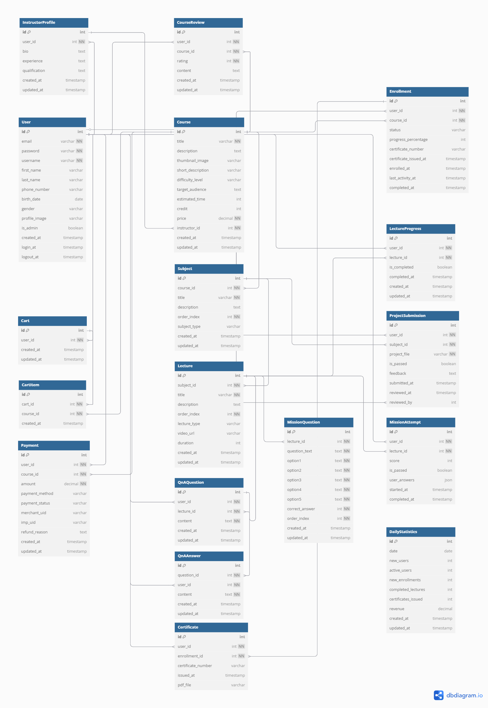

# 스킬브릿지 (SkillBridge)


## 📚 프로젝트 소개

스킬브릿지는 온라인 학습 플랫폼으로, 다양한 기술 분야의 강의를 제공하고 사용자들이 효과적으로 학습할 수 있는 환경을 제공합니다. 실무 중심의 미션, 프로젝트 기반 학습, 그리고 수료증 발급 시스템을 통해 사용자들이 체계적으로 기술을 습득할 수 있도록 설계되었습니다.

### 핵심 기능

- 😀 개인화된 사용자 경험 및 학습 관리
- 📝 체계적인 과정 관리 및 진행 상황 추적
- 🎓 미션, 프로젝트 기반의 실무 중심 학습
- 🏆 과정 완료 후 수료증 발급
- 💳 간편한 과정 결제 시스템
- 👨‍🏫 강사-학생 간 Q&A 소통 기능
- 👨‍💼 관리자를 위한 통합 플랫폼 관리 도구

---

## 💻 기술 스택

### 백엔드

- **언어 및 프레임워크**: Python>=3.13, Django>=5.1
- **데이터베이스**: PostgreSQL (프로덕션), SQLite (개발)
- **사용자 인증**: Django-allauth, Social-auth-app-django

### 프론트엔드

- **프레임워크**: Django Templates
- **스타일링**: TailwindCSS
- **자바스크립트**: Vanilla JS

### 결제 시스템

- **결제 게이트웨이**: 포트원(구 아임포트)
- **결제 검증**: Iamport-rest-client

### 기타 도구

- **배포**: Docker, AWS
- **모니터링**: Django Logging
- **PDF 생성**: ReportLab

---

## 📱 주요 기능 설명

### 1. 사용자 계정 관리

사용자들은 일반 회원가입 또는 소셜 로그인(Google, Kakao)을 통해 계정을 생성할 수 있습니다. 프로필 관리 기능을 통해 개인 정보 및 프로필 이미지를 관리할 수 있으며, 필요시 계정 탈퇴도 가능합니다.


### 2. 과정 탐색 및 구매

홈페이지에서 다양한 과정을 탐색하고, 상세 정보를 확인한 후 장바구니에 추가할 수 있습니다. 장바구니에서 결제 과정을 거쳐 과정을 구매하면 자동으로 학습 대시보드에 추가됩니다.


### 3. 학습 경험

사용자는 학습 대시보드에서 진행 중인 과정과 완료한 과정을 확인할 수 있습니다. 과정은 비디오 강의, 미션(퀴즈), 프로젝트로 구성되어 있으며, 각 과목별로 진행 상황을 체계적으로 추적할 수 있습니다.

#### 미션(퀴즈)

각 강의 이후에는 미션(퀴즈)을 통해 학습 내용을 확인하고 복습할 수 있습니다. 80% 이상 정답을 맞추면 통과하게 됩니다.

#### 프로젝트 제출

중간고사/기말고사 형태의 프로젝트를 제출하고, 관리자의 평가를 받을 수 있습니다.


#### 비디오 강의

고품질의 비디오 콘텐츠를 통해 학습하며, 강의 내용에 대한 질문을 통해 강사와 소통할 수 있습니다.


### 4. 진행 관리 및 성취

사용자는 과정의 진행 상황을 실시간으로 확인할 수 있으며, 모든 강의와 과제를 완료하면 수료증을 발급받을 수 있습니다.

#### 수료증 발급

과정 완료 후 발급되는 수료증은 PDF로 다운로드 가능하며, 고유한 인증 번호가 부여됩니다.


### 5. 관리자 포털

관리자는 전용 포털을 통해 다양한 통계 데이터를 확인하고, 수강생들의 학습 상황을 모니터링하며, 프로젝트 평가 및 Q&A 답변 등의 업무를 수행할 수 있습니다.

#### 대시보드 통계

사용자 수, 과정 등록 수, 수료증 발급 수 등 다양한 통계 데이터를 시각적으로 확인할 수 있습니다.

#### 프로젝트 평가

학생들이 제출한 프로젝트를 평가하고 피드백을 제공할 수 있습니다.


---

## 🚀 설치 및 실행 방법

### 개발 환경 설정

1. 저장소 클론

```bash
git clone https://github.com/your-username/skillbridge.git
cd skillbridge
```

2. pdm 설치

https://pdm-project.org/en/latest/ 참고

3. 의존성 설치 (가상환경 자동 생성)

```bash
pdm install -d
```

4. 환경 변수 설정

```bash
touch .env
```

.env 파일에 아래 내용을 추가합니다:

```
# 개발 환경 설정 (dummy: 개발용 더미값)

DJANGO_SETTINGS_MODULE=config.settings.dev
SECRET_KEY=dummy
ALLOWED_HOSTS=localhost,127.0.0.1

# 소셜 로그인 설정 (dummy: 개발용 더미값)

GOOGLE_CLIENT_ID=dummy
GOOGLE_CLIENT_SECRET=dummy
KAKAO_CLIENT_ID=dummy
KAKAO_CLIENT_SECRET=dummy

# 결제 관련 설정 (dummy: 개발용 더미값)

PORTONE_PG_PROVIDER=dummy
PORTONE_SHOP_ID=dummy
PORTONE_API_KEY=dummy
PORTONE_API_SECRET=dummy
```

5. 데이터베이스 마이그레이션

```bash
pdm run python manage.py migrate
```

6. 개발 서버 실행

```bash
pdm run python manage.py runserver
```

서버는 기본적으로 http://127.0.0.1:8000/ 에서 실행됩니다.

### 로컬 환경 배포

Docker와 Docker Compose를 사용한 배포:

```bash
docker-compose up -d --build
```

---

## 📊 데이터베이스 스키마

프로젝트의 주요 모델과 관계를 보여주는 ER 다이어그램:



### 주요 모델 구조

- **User**: 확장된 사용자 모델 (AbstractUser 상속)
- **Course**: 과정 정보 및 메타데이터
- **Subject**: 과정 내 과목 정보
- **Lecture**: 과목 내 개별 강의 (비디오 또는 미션)
- **Enrollment**: 사용자의 과정 등록 정보
- **LectureProgress**: 강의별 진행 상황
- **Certificate**: 수료증 정보
- **Payment**: 결제 정보

---

## 🔍 주요 기술적 도전과 해결책

### 1. 복잡한 학습 진행 상황 추적

과정, 과목, 강의의 계층적 구조에서 사용자의 학습 진행 상황을 효율적으로 추적하는 것이 도전적이었습니다. 이를 해결하기 위해 Django 시그널을 활용하여 강의 완료, 미션 통과, 프로젝트 통과 시 자동으로 상위 항목의 진행 상황이 업데이트되도록 구현했습니다.

### 2. 결제 시스템 통합

포트원(구 아임포트) API를 이용한 결제 시스템 통합 과정에서, 안전한 결제 검증 및 환불 처리가 중요한 도전이었습니다. 클라이언트 측 결제 요청과 서버 측 검증을 분리하여 보안을 강화하고, 트랜잭션 관리를 통해 데이터 일관성을 유지했습니다.

### 3. 성능 최적화

대량의 학습 데이터와 통계 처리 시 성능 이슈가 발생했습니다. 이를 해결하기 위해 쿼리 최적화, 인덱싱, 캐싱 등의 기법을 적용했습니다.

---

## 📈 프로젝트 현황 및 향후 발전 방향

### 현재 상태

- 기본적인 학습 관리 시스템 구현 완료
- 강의, 미션, 프로젝트 기능 구현
- 결제 시스템 통합
- 관리자 포털 구현

### 향후 발전 방향

- **모바일 최적화**: 반응형 디자인 개선 및 PWA 지원
- **강의 내용 검색 기능**: 전문 검색 엔진 통합
- **실시간 알림 시스템**: WebSocket을 활용한 알림 기능
- **API 서비스**: REST API 제공으로 외부 서비스 연동 지원
- **머신러닝 기반 추천**: 사용자별 맞춤형 학습 과정 추천

---

## 📝 라이센스

이 프로젝트는 MIT 라이센스 하에 배포됩니다. 자세한 내용은 [LICENSE](LICENSE) 파일을 참조하세요.

---

© 2025 스킬브릿지. All rights reserved.
